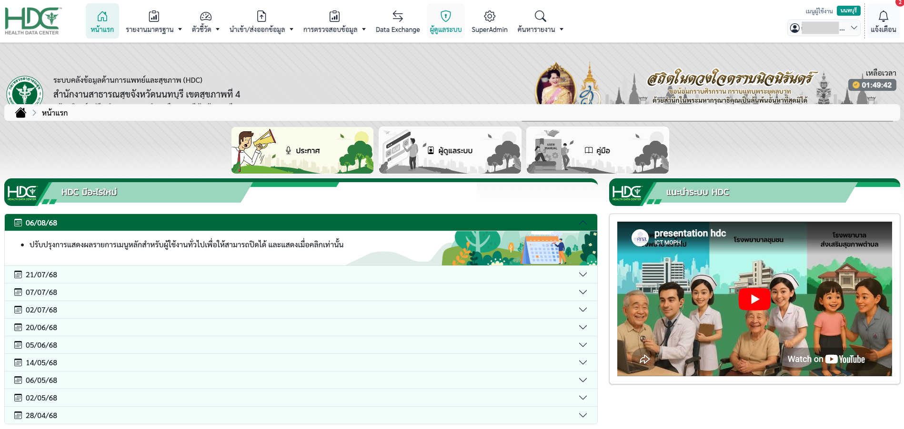
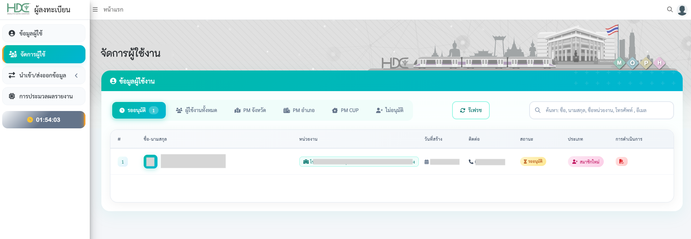
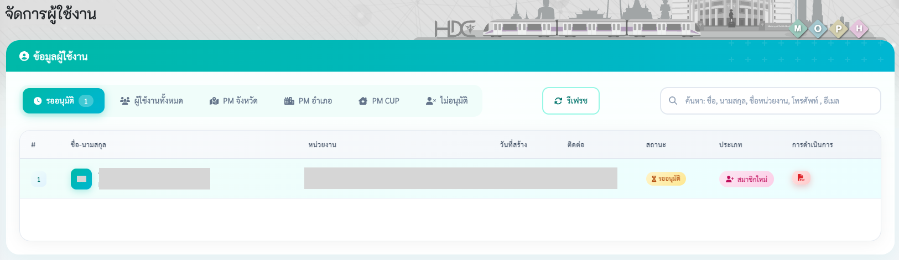
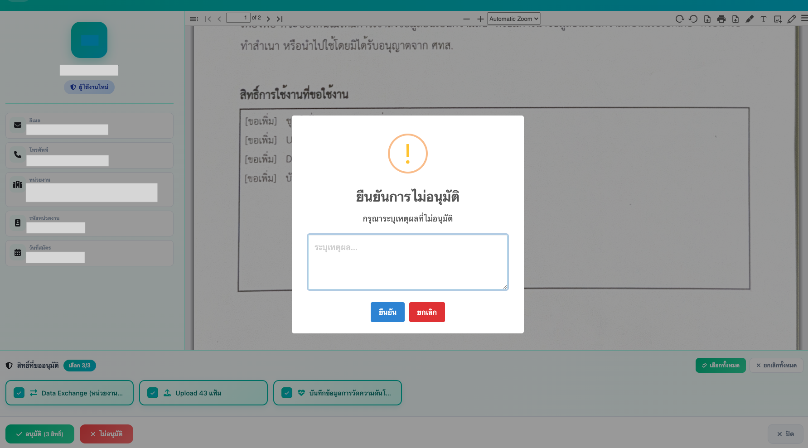

# คู่มือแอดมิน: การจัดการและอนุมัติผู้ใช้งานระบบ HDC

ขั้นตอนการตรวจสอบและดำเนินการอนุมัติหรือไม่อนุมัติสิทธิ์การใช้งานสำหรับเจ้าหน้าที่ในระบบ HDC มีรายละเอียดดังนี้ 

## 📋 เงื่อนไขเบื้องต้น
ผู้ที่จะทำหน้าที่เป็น Admin ได้นั้น จะต้องเป็นผู้ที่ **ขึ้นทะเบียนผ่าน Heidi เรียบร้อยแล้ว** เท่านั้น 

---

## 1. การเข้าสู่ระบบ (Login)
1. เข้าไปที่เว็บไซต์ HDC จังหวัด **[https://hdc.moph.go.th/xxx](https://hdc.moph.go.th/)** 
2. คลิกปุ่ม **"เข้าสู่ระบบ"** บริเวณมุมขวาบนของหน้าจอ
    
3. ลงชื่อเข้าใช้งาน (Login) ด้วยบัญชี **MyMOPH** หรือ **ThaiD**
    

---

## 2. เข้าสู่เมนูจัดการผู้ใช้
1. เมื่อเข้าสู่ระบบสำเร็จ ให้คลิกเมนู **"ผู้ดูแลระบบ"** (หรือไอคอนโล่สีเขียว) ที่แถบเมนูด้านบน
    
2. ระบบจะเปิดหน้าต่างใหม่ให้เลือกเมนู **"จัดการผู้ใช้"** ที่แถบเมนูด้านซ้าย
3. ในแท็บ **"รออนุมัติ"** จะแสดงรายชื่อผู้ใช้งานที่ส่งคำขอเข้ามาใหม่
   

---

## 3. การตรวจสอบเอกสารและสิทธิ์ที่ขอใช้งาน
1. คลิกไอคอน **PDF** ที่ **การดำเนินการ** ของรายชื่อผู้ใช้งานที่ต้องการจัดการ เพื่อเปิดดูรายละเอียดคำขอ
   
2. **ด้านขวา (Preview เอกสาร):** ตรวจสอบไฟล์เอกสารคำขอเปิดสิทธิ์ที่ผู้ใช้แนบมาอย่างละเอียด
   
3. **ด้านซ้าย (ข้อมูลผู้ขอ):** ตรวจสอบข้อมูลส่วนตัว หน่วยงาน และรหัสหน่วยงานให้ตรงกับเอกสาร
4. **ด้านล่าง (สิทธิ์ที่ขออนุมัติ):** ระบบจะแสดงรายการสิทธิ์ที่ผู้ใช้เลือก (เช่น *Data Exchange, Upload 43 แฟ้ม, บันทึกข้อมูล Home BP*) ให้ตรวจสอบว่าตรงกับสิทธิ์ที่ระบุในใบคำขอหรือไม่
    
    * แอดมินสามารถคลิก **"เลือกทั้งหมด"** หรือเลือกติ๊กเฉพาะบางสิทธิ์ที่ถูกต้องได้

---

## 4. การดำเนินการ (อนุมัติ / ไม่อนุมัติ)

#### **กรณีข้อมูลถูกต้อง (อนุมัติ)**
* **ขั้นที่ 1:** ตรวจสอบให้มั่นใจว่าเครื่องหมายถูกสีเขียวอยู่บนสิทธิ์ที่ต้องการอนุมัติครบถ้วน
* **ขั้นที่ 2:** คลิกปุ่ม **"อนุมัติ (ตามจำนวนสิทธิ์)"** สีเขียวด้านมุมซ้ายล่าง เพื่อยืนยันการเปิดสิทธิ์ใช้งาน

---

#### **กรณีข้อมูลไม่ถูกต้องหรือเอกสารไม่สมบูรณ์ (ไม่อนุมัติ)**

* **ขั้นที่ 1:** คลิกปุ่ม **"ไม่อนุมัติ"** สีแดงด้านมุมซ้ายล่าง
* **ขั้นที่ 2:** ระบบจะแสดงป๊อปอัปให้ยืนยันการไม่อนุมัติ
* **ขั้นที่ 3:** แอดมิน **จำเป็นต้องระบุเหตุผล** ในช่อง "ระบุเหตุผล..." *(เช่น เอกสารไม่สมบูรณ์, แนบไฟล์ผิด, สิทธิ์ไม่ตรงกับใบคำขอ)* เพื่อให้ผู้ยื่นคำขอนำไปแก้ไขและยื่นคำขอใหม่
* **ขั้นที่ 4:** คลิกปุ่ม **"ยืนยัน"** สีฟ้าเพื่อเสร็จสิ้นกระบวนการ

---

!!! tip "การแจ้งเตือน"
    เมื่อ Admin อนุมัติสิทธิ์เรียบร้อยแล้ว ระบบจะส่ง **SMS** แจ้งเตือนไปยังผู้ใช้งานโดยอัตโนมัติ 
