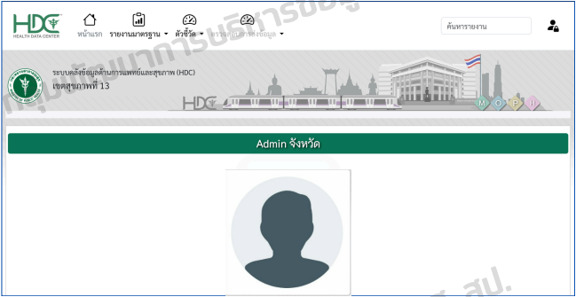
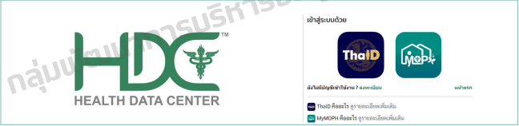
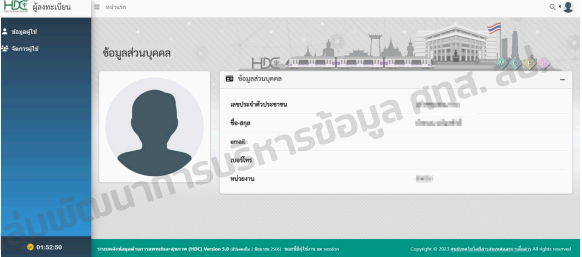
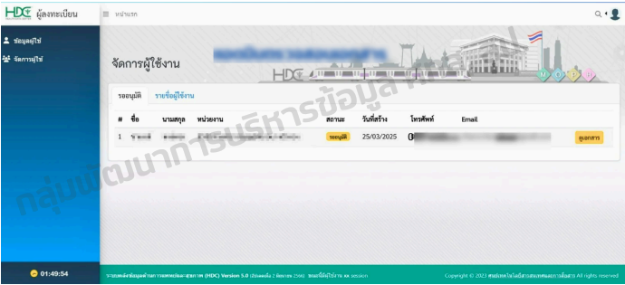
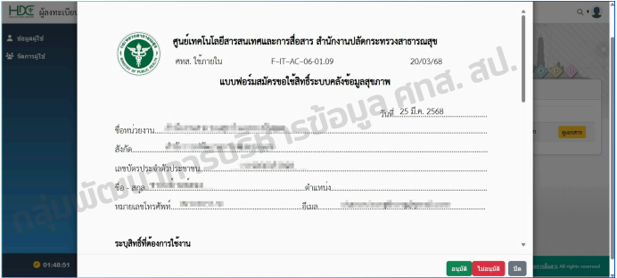
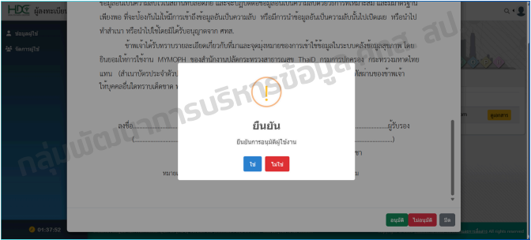
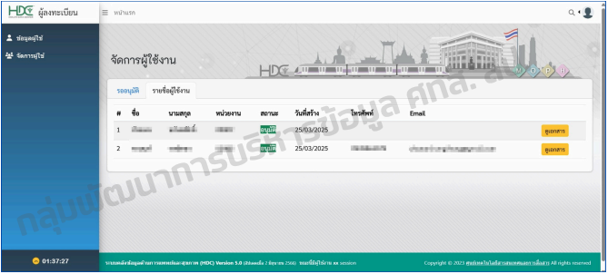

# คู่มือผู้ดูแลระบบ (HDC Admin)

หน้านี้สรุปขั้นตอนสำหรับ **ผู้ดูแลระบบ (Admin)** ของสำนักงานสาธารณสุขจังหวัด ในการจัดการและอนุมัติสิทธิ์ผู้ใช้งานในระบบ HDC 

---

## 📋 เงื่อนไขเบื้องต้น
ผู้ที่จะทำหน้าที่เป็น Admin ได้นั้น จะต้องเป็นผู้ที่ **ขึ้นทะเบียนผ่านระบบ Heidi เรียบร้อยแล้ว** เท่านั้น 

---

## 🔐 ขั้นตอนการเข้าใช้งานระบบ
1. เข้าไปที่เว็บไซต์ **[https://hdc.moph.go.th/xxx](https://hdc.moph.go.th/)** 
    
2. ลงชื่อเข้าใช้งาน (Login) ด้วยบัญชี **MyMOPH** หรือ **ThaiD**
    
3. เมื่อเข้าสู่ระบบแล้ว จะพบกับหน้าจอ **ข้อมูลส่วนบุคคล (แอดมิน)**
    

---

## ✅ ขั้นตอนการอนุมัติสิทธิ์ผู้ใช้งาน
Admin มีหน้าที่ตรวจสอบและอนุมัติคำขอของผู้ใช้งานที่ลงทะเบียนเข้ามาใหม่ตามขั้นตอนดังนี้:

### 1. ตรวจสอบรายชื่อผู้รออนุมัติ
* ไปที่เมนู **"จัดการผู้ใช้"** > **"ข้อมูลผู้ใช้รออนุมัติ"** 
* ระบบจะแสดงรายการผู้สมัคร พร้อมรายละเอียด เช่น ชื่อ-นามสกุล, หน่วยงาน, และวันที่สร้างรายการ 
    

### 2. ตรวจสอบเอกสารหลักฐาน
* คลิกปุ่ม **"ดูเอกสาร"** เพื่อตรวจสอบแบบฟอร์มสมัครขอใช้สิทธิ์ 
* **สิ่งที่ต้องตรวจสอบ:** 
    * สิทธิ์ที่ผู้สมัครต้องการใช้งาน
    * ลายเซ็นของผู้สมัคร
    * ลายเซ็นของผู้บังคับบัญชาที่รับรองความถูกต้อง

!!! abstract "แบบฟอร์มที่ใช้"
    แบบฟอร์มสมัครขอใช้สิทธิ์ระบบคลังข้อมูลสุขภาพ (รหัส F-IT-AC-06-01.09) 
    

### 3. ยืนยันการอนุมัติ
* หากข้อมูลและเอกสารครบถ้วน ให้คลิกปุ่ม **"อนุมัติ"** 
* ระบบจะแสดงหน้าต่างยืนยันการอนุมัติ ให้กดเลือก **"ใช่"** เพื่อยืนยัน
    
* ระบบแสดงรายชื่อผู้ใช้งานที่ได้รับการอนุมัติสิทธิ์แล้ว
    

!!! tip "การแจ้งเตือน"
    เมื่อ Admin อนุมัติสิทธิ์เรียบร้อยแล้ว ระบบจะส่ง **SMS** แจ้งเตือนไปยังผู้ใช้งานโดยอัตโนมัติ (เริ่มใช้งานเต็มรูปแบบภายในสิ้นเดือนมีนาคม 2568) 

---

## 🚫 การปฏิเสธสิทธิ์ (ไม่อนุมัติ)
ในกรณีที่เอกสารไม่ถูกต้อง หรือข้อมูลไม่ครบถ้วน Admin สามารถเลือกปุ่ม **"ไม่อนุมัติ"** พร้อมระบุเหตุผลเพื่อให้ผู้ใช้งานดำเนินการแก้ไขและยื่นคำขอใหม่ 

---

## ⚙️ การจัดการข้อมูลส่วนบุคคล
Admin สามารถตรวจสอบและแก้ไขข้อมูลส่วนตัวของตนเองได้ที่เมนู **"ข้อมูลส่วนบุคคล"** ซึ่งจะแสดงเลขประจำตัวประชาชน, ชื่อ-สกุล และหน่วยงานสังกัดที่ระบุไว้ในระบบ 

!!! warning "ความปลอดภัย"
    Admin ต้องรักษาความลับของข้อมูลสุขภาพตามมาตรฐานของ ศทส. และป้องกันไม่ให้มีการเข้าถึงข้อมูลโดยไม่ได้รับอนุญาต