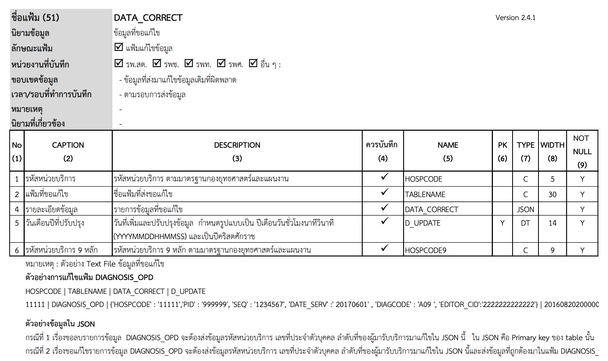
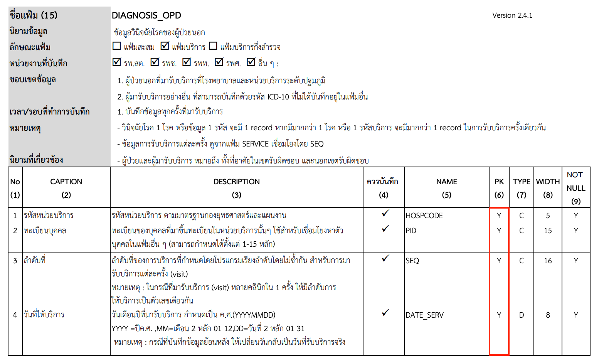
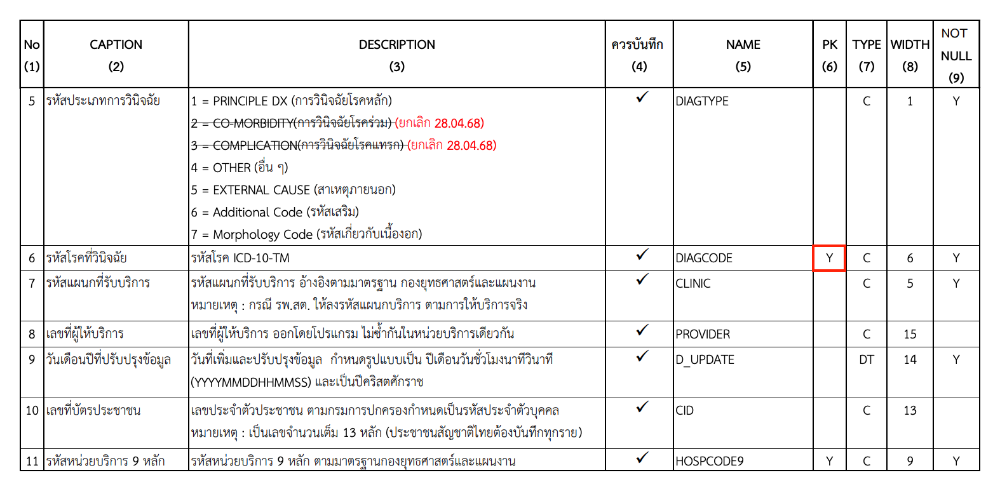

# คู่มือการส่งแฟ้ม DATA_CORRECT (การแก้ไข/ลบข้อมูล)

แฟ้ม **DATA_CORRECT** ใช้สำหรับแจ้งความประสงค์ในการ **"ลบ"** ข้อมูลที่เคยส่งเข้าสู่ระบบคลังข้อมูลด้านการแพทย์และสุขภาพ (HDC) เพื่อให้ข้อมูลมีความถูกต้องและเป็นปัจจุบันมากที่สุด

---

## 🏗️ โครงสร้างแฟ้ม DATA_CORRECT



ในการจัดทำแฟ้มนี้ ท่านจำเป็นต้องระบุข้อมูลให้ครบถ้วนตามโครงสร้างมาตรฐาน ดังนี้:

| ชื่อฟิลด์ | รายละเอียด | หมายเหตุ |
| :--- | :--- | :--- |
| **HOSPCODE** | รหัสหน่วยบริการ 5 หลัก | ผู้ขอลบ/แก้ไขข้อมูล |
| **TABLENAME** | ชื่อแฟ้มที่ต้องการแก้ไข | เช่น `DIAGNOSIS_OPD`, `PROCEDURE_OPD` |
| **DATA_CORRECT** | รายการข้อมูลในรูปแบบ JSON | ต้องระบุ Primary Key ของรายการนั้นให้ครบ |
| **D_UPDATE** | วันเวลาที่ปรับปรุงข้อมูล | รูปแบบ YYYYMMDDHHMMSS |

!!! info "ข้อมูลสำคัญเกี่ยวกับรหัสหน่วยบริการ"
    * ในการประมวลผลเพื่อลบข้อมูล **ระบบจะยึดตามรหัสหน่วยบริการ 5 หลัก (HOSPCODE) เป็นหลัก**
    * **HOSPCODE9 (รหัส 9 หลัก):** ท่านจะส่งหรือไม่ส่งมาด้วยก็ได้ เนื่องจากในกระบวนการลบข้อมูล ระบบยังคงอ้างอิงและใช้รหัส 5 หลักในการระบุหน่วยบริการ

---

## 🛠️ ขั้นตอนการเตรียมข้อมูล (ตัวอย่าง: แฟ้ม DIAGNOSIS_OPD)

หากท่านต้องการลบข้อมูลการวินิจฉัยโรคที่ไม่ถูกต้อง ให้ดำเนินการตามลำดับดังนี้:

### 1. ตรวจสอบ Primary Key ของแฟ้มเป้าหมาย
ก่อนจะลบข้อมูล ท่านต้องทราบก่อนว่าแฟ้มนั้นใช้ฟิลด์ใดเป็นกุญแจหลัก (Primary Key) เพื่อให้ระบบลบข้อมูลได้ถูกรายการ



* **ตัวอย่าง DIAGNOSIS_OPD:** ต้องใช้ `HOSPCODE`, `PID`, `SEQ`, `DATE_SERV`, และ `DIAGCODE` ร่วมกัน

### 2. เขียนคำสั่งในรูปแบบ JSON
นำ Primary Key มาเขียนรวมกันในรูปแบบ JSON Object พร้อมระบุเลขบัตรประชาชนผู้ดำเนินการ (`EDITOR_CID`)

**ตัวอย่างรูปแบบข้อมูล:**
```
{
  'HOSPCODE': '11111',
  'PID': '999999',
  'SEQ': '1234567',
  'DATE_SERV': '20240601',
  'DIAGCODE': 'A09',
  'EDITOR_CID': '2222222222222'
}
```

!!! note "หมายเหตุเกี่ยวกับ EDITOR_CID"
    **EDITOR_CID** คือ เลขประจำตัวประชาชนของผู้ขอลบข้อมูล ซึ่งต้องเป็นผู้ที่มีรายชื่ออยู่ในแฟ้ม PROVIDER เพื่อใช้ในการตรวจสอบสิทธิ์และบันทึกประวัติการแก้ไขข้อมูล

### 3. สร้างไฟล์ DATA_CORRECT.txt
จัดทำไฟล์ข้อความ (Text file) โดยตั้งชื่อไฟล์ว่า `DATA_CORRECT.txt` และใช้เครื่องมือคั่นข้อมูลตามมาตรฐาน (Pipe Delimited `|`) โดยมีลำดับฟิลด์คือ `HOSPCODE|TABLENAME|DATA_CORRECT|D_UPDATE`

**ตัวอย่างข้อมูลภายในไฟล์:**
```
HOSPCODE|TABLENAME|DATA_CORRECT|D_UPDATE
11111|DIAGNOSIS_OPD|{'HOSPCODE':'11111','PID':'999999','SEQ':'1234567','DATE_SERV':'20170601','DIAGCODE':'A09','EDITOR_CID':'2222222222222'}|20160820200000`
```

---

## 📤 การอัปโหลดข้อมูล
กระบวนการส่งไฟล์ `DATA_CORRECT.txt` เข้าสู่ระบบ HDC ให้ดำเนินการตามขั้นตอนมาตรฐานการอัปโหลดข้อมูล 43 แฟ้ม

!!! info "ศึกษาเพิ่มเติม"
    ท่านสามารถศึกษารายละเอียดและขั้นตอนการอัปโหลดได้ที่:

    👉 [คู่มือการอัปโหลดข้อมูล 43 แฟ้ม](/hdc-docs/manual/upload-43-files/)

!!! warning "ข้อควรระวัง"
    * ข้อมูลที่ต้องการลบ **ต้องมีอยู่จริง** ในระบบ HDC เท่านั้น
    * หากระบุ Primary Key ไม่ครบ ระบบจะไม่สามารถค้นหาและลบรายการดังกล่าวได้

---

## 📚 แหล่งอ้างอิงเพิ่มเติม
* [คู่มือการปฏิบัติงานการจัดเก็บและส่งข้อมูล ฉบับปรับปรุง ปีงบประมาณ 2568 (Version 2.4.1)](https://hdata.moph.go.th/site/wp-content/uploads/2025/04/43-file-Structure_Version-2.4.128.04.68.pdf)
* โครงสร้างมาตรฐานข้อมูลด้านสุขภาพ (43 แฟ้ม): [hdata.moph.go.th](https://hdata.moph.go.th)

