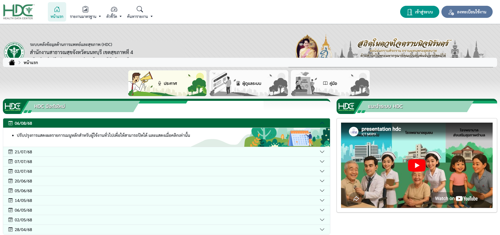
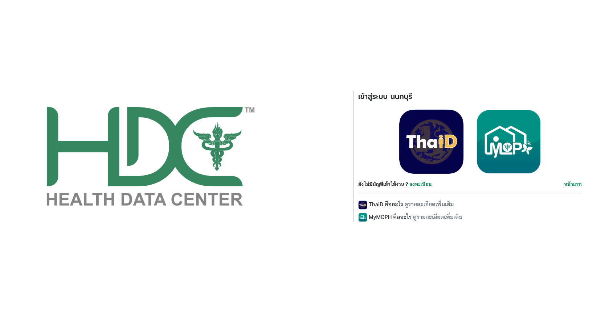
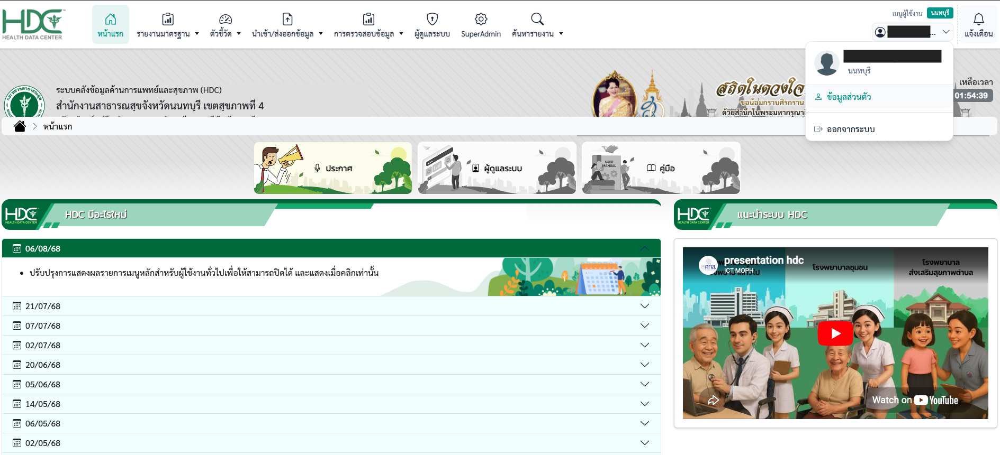
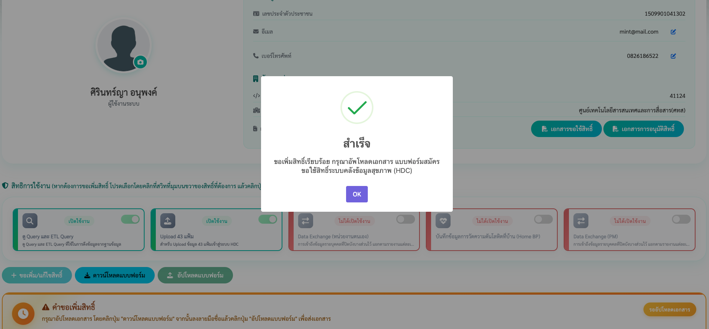
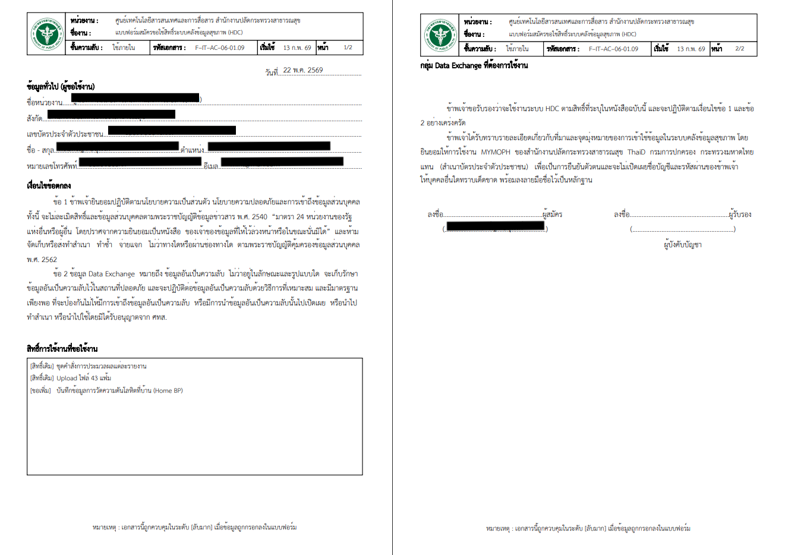
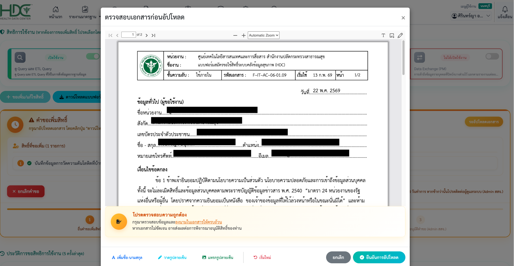
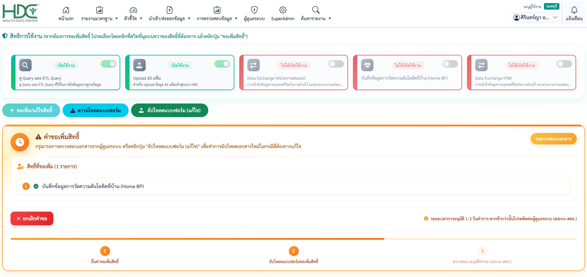
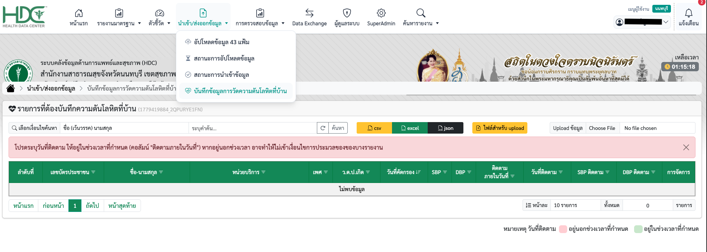
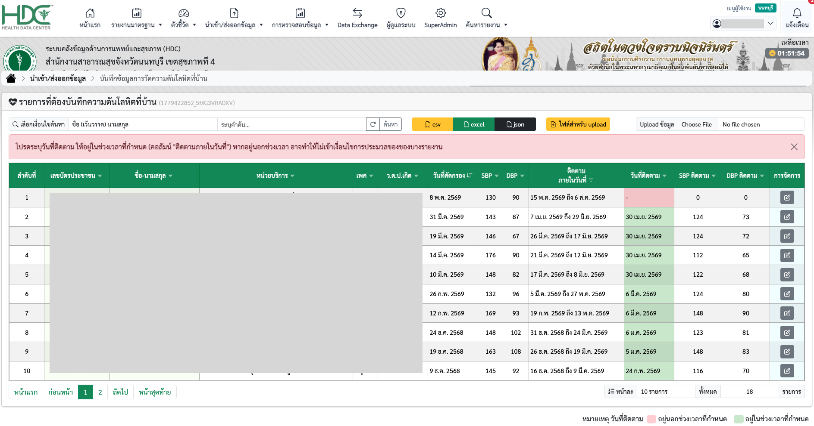

# คู่มือการใช้งานเมนู Home BP (บันทึกข้อมูลการวัดความดันโลหิตที่บ้าน)

คู่มือนี้แนะนำขั้นตอนการขอสิทธิ์และการใช้งานเมนู Home BP บนระบบคลังข้อมูลสุขภาพ (HDC) เพื่อให้หน่วยบริการสามารถบันทึกข้อมูลการวัดความดันโลหิตของผู้ป่วยที่บ้านได้อย่างถูกต้อง

---

## ขั้นตอนที่ 1: การเข้าสู่ระบบ (Login)

1. ไปที่เว็บไซต์ระบบ **HDC** ของจังหวัดท่าน (เช่น `https://hdc.moph.go.th/xxx`) 
2. ที่หน้าแรกของระบบให้คลิกปุ่ม **"เข้าสู่ระบบ"** บริเวณมุมขวาบน
    

3. เลือกช่องทางการเข้าสู่ระบ:
    - **ThaiID** (กรมการปกครอง)
    - **MyMOPH** (กระทรวงสาธารณสุข)
    

---

## ขั้นตอนที่ 2: การขอเพิ่มสิทธิ์การใช้งาน (กรณีที่ยังไม่มีสิทธิ์)

!!! info "คำแนะนำ"
    สิทธิ์การบันทึกข้อมูล Home BP ไม่ได้ถูกเปิดใช้งานเป็นค่าเริ่มต้น ผู้ใช้ต้องส่งคำขอและรอการอนุมัติจากผู้ดูแลระบบ 

1. คลิกที่รูปโปรไฟล์มุมขวาบน เลือก **"ข้อมูลส่วนตัว"**
    

2. เลื่อนลงมาที่หัวข้อสิทธิ์การใช้งาน เลื่อนสวิตช์เปิดที่กล่อง **"บันทึกข้อมูลการวัดความดันโลหิตที่บ้าน (Home BP)"** ให้เป็นสีเขียว
3. คลิกปุ่ม **"+ ขอเพิ่ม/แก้ไขสิทธิ์"** ระบบจะแสดงหน้าต่างแจ้งเตือนสำเร็จ ให้คลิก **"OK"**
    

4. คลิกปุ่ม **"ดาวน์โหลดแบบฟอร์ม"** เพื่อพิมพ์เอกสารคำขอเปิดใช้สิทธิ์ระบบ HDC ลงลายมือชื่อตนเอง และผู้บังคับบัญชา (ผู้รับรอง)
    
     
5. กลับมาที่หน้าเดิม คลิกปุ่ม **"อัปโหลดแบบฟอร์ม"** ตรวจสอบเอกสารความถูกต้องบนหน้าจอ จากนั้นคลิก **"ยืนยันการอัปโหลด"**
    

6. สถานะจะแสดง **"รอตรวจสอบเอกสาร"** (ใช้เวลาอนุมัติโดย Admin สสจ. ประมาณ 1-3 วันทำการ) เมื่อได้รับการอนุมัติแล้ว กล่องสิทธิ์จะเปลี่ยนเป็นสีเขียวและแสดงสถานะ **"เปิดใช้งาน"**

    

---

## ขั้นตอนที่ 3: การเข้าสู่เมนูและการบันทึกข้อมูล

เมื่อผู้ดูแลระบบอนุมัติสิทธิ์เรียบร้อยแล้ว ท่านสามารถเริ่มบันทึกข้อมูลได้ตามขั้นตอนดังนี้:

1. ไปที่เมนูหลักด้านบน เลือก **"นำเข้า/ส่งออกข้อมูล"** -> **"บันทึกข้อมูลการวัดความดันโลหิตที่บ้าน"**
    
2. ระบบจะแสดงตาราง **"รายการที่ต้องบันทึกความดันโลหิตที่บ้าน"** ของผู้ป่วยในหน่วยบริการของท่าน
    

### 💡 คำแนะนำเพิ่มเติมในการใช้งาน:
* **การอ่านสัญลักษณ์สีในตาราง:**
    - **แถบสีเขียว** ในคอลัมน์ "วันที่ติดตาม": ข้อมูลการติดตามอยู่ในช่วงเวลาที่กำหนด
    - **แถบสีชมพู**: ข้อมูลอยู่นอกช่วงเวลาที่กำหนด หรือยังไม่ได้ระบุวันติดตาม (อาจมีผลทำให้ไม่เข้าเงื่อนไขการประมวลผลรายงาน)
* **การค้นหาข้อมูล:** สามารถพิมพ์ค้นหาด้วย ชื่อ-นามสกุล หรือระบุคำค้นหาได้ที่ช่องค้นหาด้านบนตาราง
* **การส่งออกและนำเข้าข้อมูล (Bulk Upload):**
    - **ส่งออกข้อมูล (Export):** คลิกปุ่ม `csv`, `excel` หรือ `json` เพื่อนำไฟล์รายชื่อออกไปบริหารจัดการภายนอกระบบ
    - **นำเข้าข้อมูล (Import):** หากต้องการบันทึกข้อมูลจำนวนมากผ่านไฟล์ ให้คลิกปุ่ม **"ไฟล์สำหรับ upload"** จากนั้นกด **"Choose File"** เพื่อเลือกไฟล์ข้อมูลที่เตรียมไว้ แล้วกด **"Upload ข้อมูล"**
* **การบันทึกข้อมูลรายบุคคล:** คลิกปุ่มไอคอน **แก้ไข/จัดการ (รูปดินสอ)** ที่ท้ายแถวรายชื่อผู้ป่วย เพื่อเปิดหน้าต่างบันทึกค่าวัดความดันโลหิต (SBP/DBP) และวันที่ติดตามเป็นรายคนได้โดยตรง