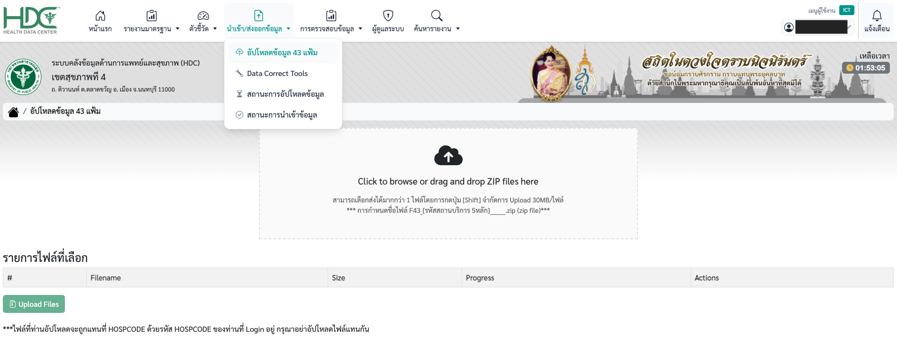
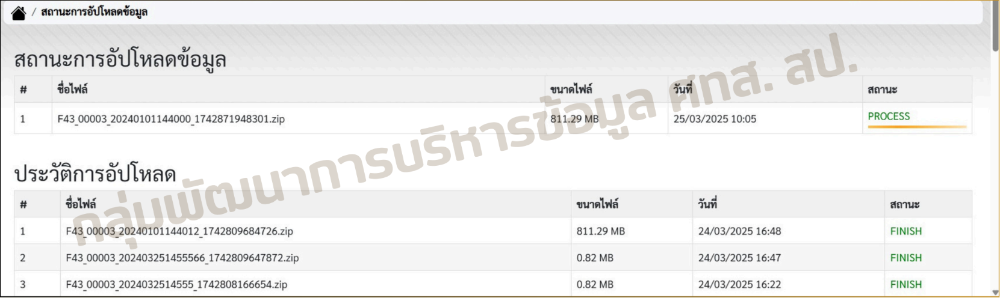
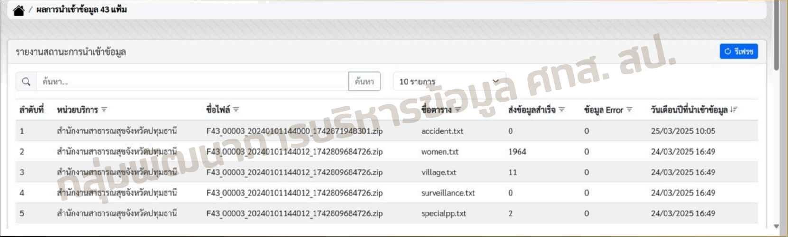

# การอัปโหลดข้อมูล 43 แฟ้ม

ขั้นตอนการนำส่งและอัปโหลดไฟล์ข้อมูลมาตรฐาน 43 แฟ้มเข้าสู่ระบบคลังข้อมูลด้านการแพทย์และสุขภาพ (HDC) สำหรับเจ้าหน้าที่และผู้รับผิดชอบงานข้อมูลของสถานบริการ

---

## สิ่งที่ต้องเตรียมก่อนการอัปโหลด
1. **ไฟล์ข้อมูลมาตรฐาน 43 แฟ้ม** ที่ผ่านการตรวจสอบความถูกต้องเรียบร้อยแล้ว
2. **การบีบอัดไฟล์ (Compression):** ต้องทำการบีบอัดไฟล์ให้อยู่ในรูปแบบ **ZIP file (`.zip`)** เท่านั้น
3. **โครงสร้างการตั้งชื่อไฟล์:** ระบบกำหนดรูปแบบการตั้งชื่อไฟล์เป็นสากล ดังนี้
   `F43_xxxxx_YYYYMMDDHHmmss.zip`
    * **xxxxx**: รหัสสถานบริการ 5 หลัก
    * **YYYYMMDDHHmmss**: ปี เดือน วัน และเวลาที่ส่งข้อมูล
4. **ขนาดไฟล์:** จำกัดขนาดไฟล์ในการอัปโหลดสูงสุดไม่เกิน **30MB ต่อไฟล์**

!!! example "ตัวอย่างชื่อไฟล์"
    `F43_41124_20250325144500.zip`

---

## ขั้นตอนการอัปโหลดข้อมูล

### 1. เข้าสู่เมนูการอัปโหลดข้อมูล
* เข้าสู่ระบบ HDC ด้วยสิทธิ์เจ้าหน้าที่หรือผู้ดูแลระบบที่ได้รับอนุญาต
* ไปที่แถบเมนูด้านบน เลือกเมนู **"นำเข้า/ส่งออกข้อมูล"**
* คลิกเลือกเมนูย่อย **"อัปโหลดข้อมูล 43 แฟ้ม"**

### 2. เลือกไฟล์ข้อมูลเพื่อทำการอัปโหลด
ระบบรองรับการเลือกไฟล์ได้ 2 วิธีการ:

* **วิธีที่ 1 (Drag and Drop):** ลากไฟล์ ZIP ที่ต้องการจากเครื่องคอมพิวเตอร์ของคุณ มาวางในกล่องพื้นที่สีขาวที่มีสัญลักษณ์ก้อนเมฆและลูกศรชี้ขึ้นพิมพ์ว่า *"Click to browse or drag and drop ZIP files here"*
* **วิธีที่ 2 (Browse):** คลิกที่บริเวณกล่องพื้นที่ดังกล่าว เพื่อเปิดหน้าต่างค้นหาและเลือกไฟล์ ZIP จากคอมพิวเตอร์

> 💡 **ข้อแนะนำเพิ่มเติม:** > * สามารถเลือกส่งไฟล์พร้อมกันได้มากกว่า 1 ไฟล์ โดยการกดปุ่ม `[Shift]` หรือ `[Ctrl]` ค้างไว้ในขณะเลือกไฟล์

### 3. ยืนยันการอัปโหลดไฟล์
* เมื่อเลือกไฟล์เรียบร้อยแล้ว รายชื่อไฟล์ ขนาด (Size) และแถบสถานะ (Progress) จะปรากฏขึ้นในตาราง **"รายการไฟล์ที่เลือก"**
* ตรวจสอบความถูกต้องของชื่อไฟล์อีกครั้ง 
* คลิกที่ปุ่มสีเขียว **" Upload Files"** ที่อยู่ด้านล่างซ้ายของตารางเพื่อเริ่มส่งไฟล์เข้าสู่ระบบ

!!! danger "ข้อกำหนดที่ต้องปฏิบัติตามอย่างเคร่งครัด"
    * **ห้ามส่งไฟล์แทนกัน:** เพื่อป้องกันความผิดพลาดและการสูญหายของข้อมูลหน่วยงานอื่น
    * **กรุณาอย่าอัปโหลดไฟล์ของรหัสสถานบริการอื่น (HOSPCODE อื่น) แทนกันโดยเด็ดขาด** ข้อมูลจะต้องส่งตรงตามสิทธิ์บัญชีผู้ใช้ที่กำลังใช้งานอยู่เท่านั้น

---

## การตรวจสอบสถานะการอัปโหลด

คุณสามารถติดตามผลได้ที่เมนู **"สถานะการอัปโหลดข้อมูล"**

---

## ผลการนำเข้าข้อมูล 43 แฟ้ม

ไปที่เมนู **"สถานะการนำเข้าข้อมูล"** เพื่อตรวจสอบรายละเอียดรายแฟ้ม (เช่น `accident.txt`, `surveillance.txt`)

!!! success "ข้อมูลที่ปรากฏในรายงาน"
    * **ส่งข้อมูลสำเร็จ**: จำนวนระเบียนที่นำเข้าได้
    * **ข้อมูล Error**: จำนวนระเบียนที่มีปัญหาและไม่เข้าสู่ระบบ
    * **วันเดือนปีที่นำเข้า**: วันที่ระบบประมวลผลข้อมูล
