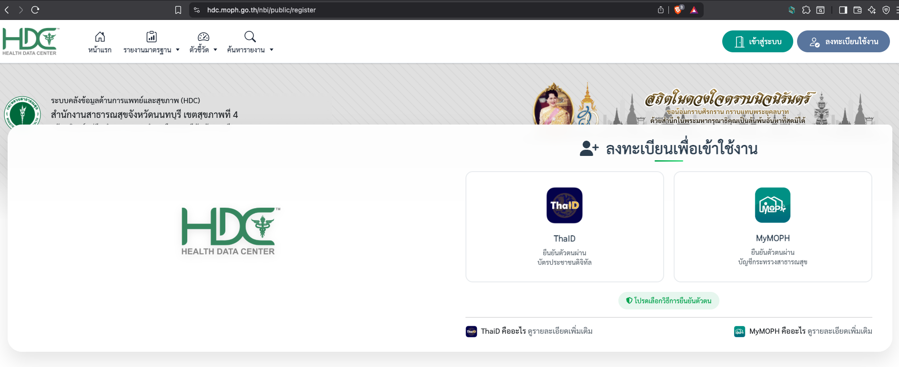
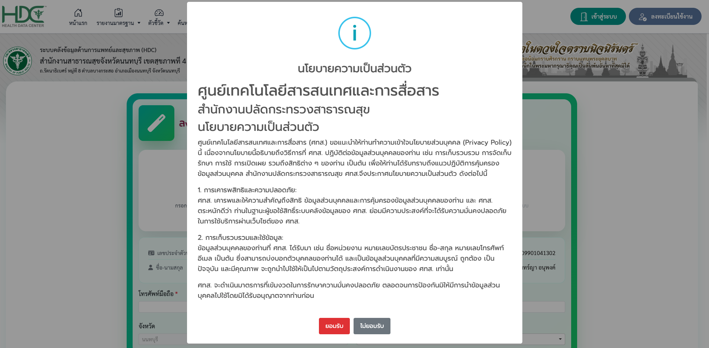
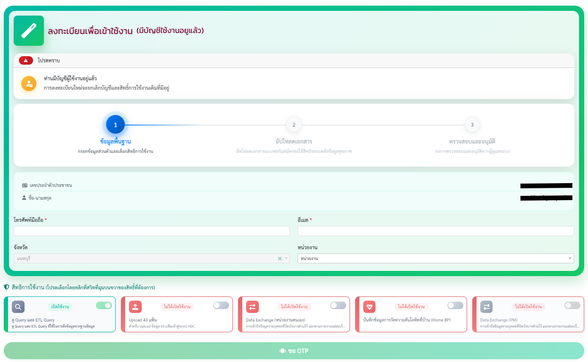
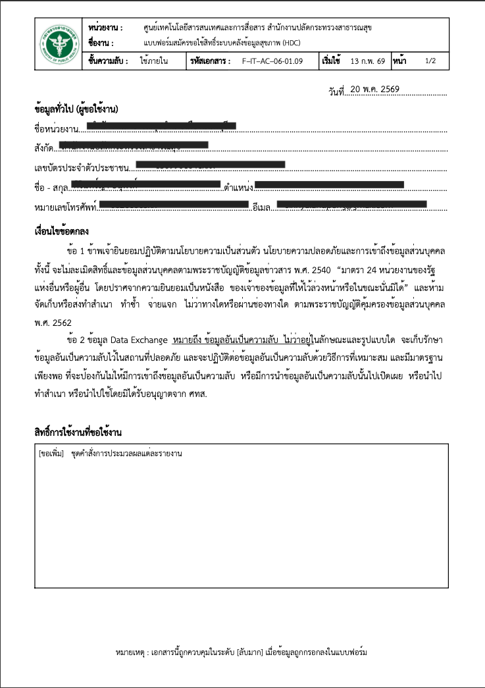
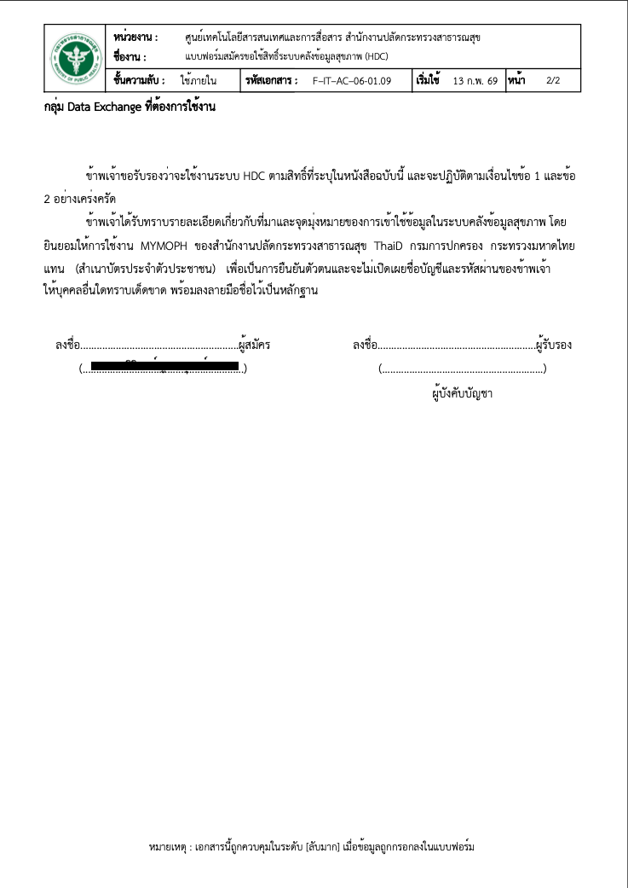
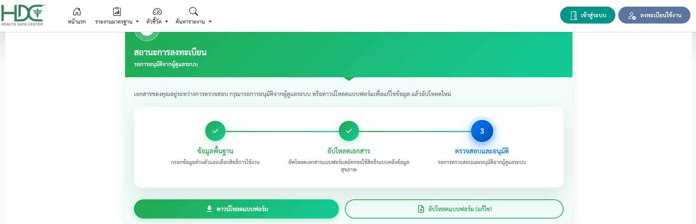

# คู่มือการสมัครใช้งานระบบ HDC (สำหรับผู้ใช้ทั่วไป)

ยินดีต้อนรับเข้าสู่ระบบคลังข้อมูลสุขภาพ (Health Data Center: HDC) หน้านี้จะแนะนำขั้นตอนการลงทะเบียนเพื่อเข้าใช้งานระบบอย่างละเอียด

---

## 🌐 ช่องทางการเข้าสู่หน้าลงทะเบียน
1. เข้าเว็บไซต์ระบบ HDC ประจำจังหวัดของท่าน **[https://hdc.moph.go.th/xxx](https://hdc.moph.go.th/)** 
2. คลิกปุ่ม **"ลงทะเบียนใช้งาน"** ที่มุมบนขวาของหน้าจอ

---

## 🔐 ขั้นตอนที่ 1: ยืนยันตัวตน และยอมรับนโยบาย
1. เลือกช่องทางการยืนยันตัวตนเพื่อลงทะเบียน โดยสามารถเลือกใช้: 
    * **ThaiD** (บัตรประชาชนดิจิทัล)
    * **MyMOPH** (บัญชีกระทรวงสาธารณสุข)

2. ยอมรับนโยบายความเป็นส่วนตัว (PDPA)
* อ่านรายละเอียดการคุ้มครองข้อมูลส่วนบุคคล แล้วคลิกปุ่ม **"ยอมรับ"** เพื่อดำเนินการต่อ

!!! info "คำแนะนำ"
    การใช้ ThaiD หรือ MyMOPH เป็นการยืนยันตัวตนแบบดิจิทัลเพื่อความปลอดภัยสูงสุดของข้อมูลสุขภาพ 

---

## 📄 ขั้นตอนที่ 2: กรอกข้อมูลพื้นฐาน และเลือกสิทธิ์การใช้งาน

ตรวจสอบและระบุรายละเอียดในฟอร์มให้ครบถ้วน:

### 1. ข้อมูลรายละเอียดผู้ใช้งาน
* **เลขบัตรประชาชน / ชื่อ-นามสกุล:** ระบบจะดึงข้อมูลมาให้โดยอัตโนมัติ (แก้ไขไม่ได้)
* **โทรศัพท์มือถือ:** กรอกเบอร์โทรศัพท์ที่ใช้งานจริงเพื่อรับรหัส OTP
* **อีเมล:** กรอกอีเมลสำหรับรับแจ้งเตือนจากระบบ
* **จังหวัด / หน่วยงาน:** เลือกสถานพยาบาลหรือหน่วยงานสาธารณสุขที่ท่านสังกัดจริง

### 2. เลือกสิทธิ์การใช้งานที่ต้องการ (คลิกเปิดสวิตช์สีเขียว)
* **ดู Query และ ETL Query:** สิทธิ์ดูซอร์สโค้ดคำสั่งและขั้นตอนการประมวลผลข้อมูล
* **Upload 43 แฟ้ม:** สิทธิ์ส่งและอัปโหลดไฟล์ข้อมูลมาตรฐาน 43 แฟ้มเข้าสู่ระบบ
* **Data Exchange (หน่วยงานตนเอง):** สิทธิ์เข้าถึงและแลกเปลี่ยนข้อมูลรายบุคคล (แบบเข้ารหัสปกปิดตัวตน) ของหน่วยงานตนเอง
* **บันทึกข้อมูลการวัดความดันโลหิตที่บ้าน (Home BP):** สิทธิ์บันทึกและติดตามผลการวัดความดันโลหิตที่บ้านของผู้ป่วย
* **Data Exchange (PM):** สิทธิ์เข้าถึงข้อมูลรายบุคคลในภาพรวมสำหรับผู้บริหารหรือผู้รับผิดชอบงานโครงการ

> 💬 เมื่อกรอกข้อมูลและเลือกสิทธิ์เรียบร้อยแล้ว ให้คลิกปุ่ม **"ขอ OTP"** นำรหัสจาก SMS มากดยืนยันเพื่อไปขั้นตอนถัดไป

---

## 📝 ขั้นตอนที่ 3: การดาวน์โหลดคำขอและการอัปโหลดเอกสารอนุมัติ
ระบบ HDC กำหนดให้ผู้ลงทะเบียนส่งเอกสารที่มีการลงนามรับรองจากผู้บังคับบัญชา เพื่อป้องกันการเข้าถึงข้อมูลโดยมิชอบ

### 1. ดาวน์โหลดและเตรียมเอกสาร
* คลิกปุ่ม **"ดาวน์โหลดแบบฟอร์ม"** ระบบจะสร้างไฟล์คำขอ (`F-IT-AC-06-01.09`) ที่กรอกข้อมูลให้ท่านโดยอัตโนมัติ
* พิมพ์ (Print) เอกสารออกมา **ลงลายมือชื่อตนเอง**
* นำไปเสนอให้ **ผู้บังคับบัญชาหรือหัวหน้าหน่วยงาน** ลงนามรับรองในเอกสาร

| | |
| :-: | :-: |
|  |  |

### 2. อัปโหลดเอกสารเข้าสู่ระบบ
* นำแบบฟอร์มที่ลงนามอนุมัติครบถ้วนแล้ว มาสแกนหรือถ่ายภาพให้ชัดเจน (รองรับไฟล์ภาพหรือ PDF ตามที่ระบบกำหนด)
* คลิกปุ่ม **"อัปโหลดแบบฟอร์ม"** ในหน้าลงทะเบียน เพื่อส่งหลักฐานเข้าสู่ระบบ

!!! abstract "แบบฟอร์มขอใช้สิทธิ์"
    เอกสารนี้ถือเป็นความลับ (สับมาก) เมื่อมีการกรอกข้อมูลลงไป โปรดระมัดระวังในการจัดเก็บ 

---

## ⏳ ขั้นตอนที่ 4: การตรวจสอบและติดตามผล
หลังจากอัปโหลดเอกสารสำเร็จ สถานะคำขอจะเปลี่ยนเป็น **"รอการอนุมัติจากผู้ดูแลระบบ"**

* **กรณีต้องแก้ไข:** สามารถกลับมากดปุ่ม **"อัปโหลดแบบฟอร์ม (แก้ไข)"** เพื่อส่งเอกสารชุดใหม่ได้ตลอดเวลา
* **เมื่ออนุมัติเสร็จสิ้น:** ระบบจะเปิดสิทธิ์ให้ท่านเข้าสู่ระบบ (Login) ใช้งานได้ทันที
---

## ❓ ต้องการความช่วยเหลือ?
หากท่านพบปัญหาในการลงทะเบียน สามารถติดต่อได้ที่:

* **แอดมินจังหวัด** สำนักงานสาธารณสุขจังหวัด (สสจ.)
