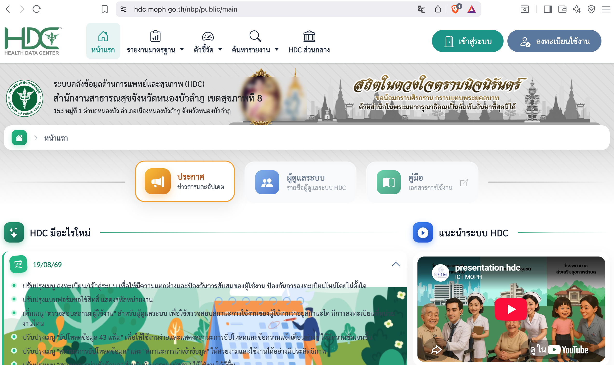
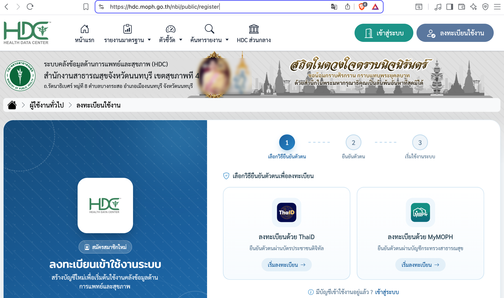
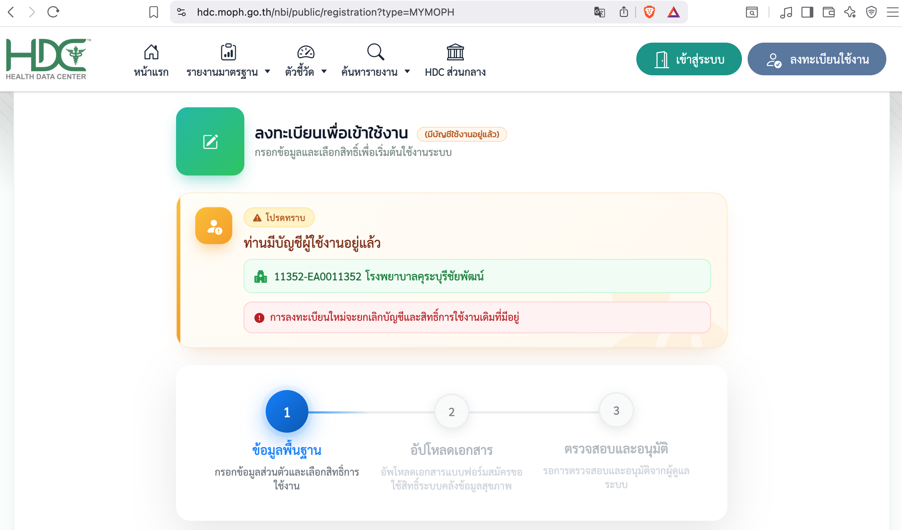
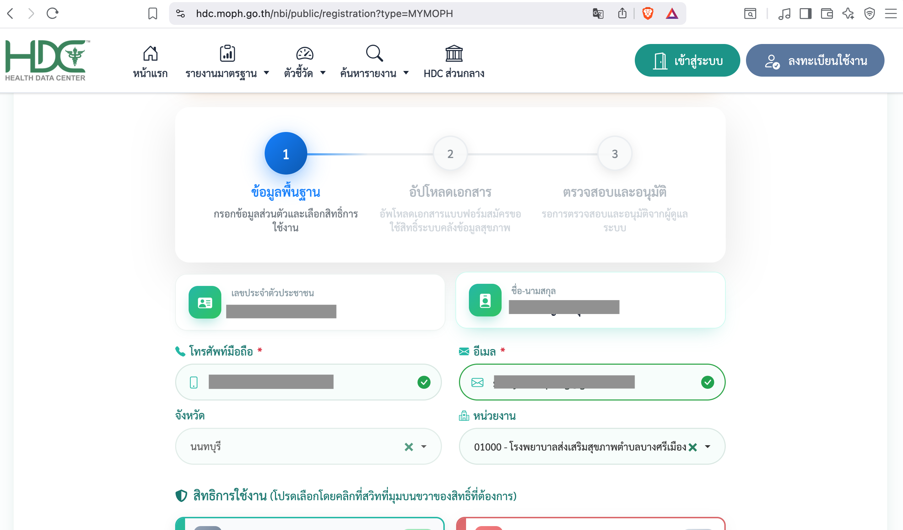
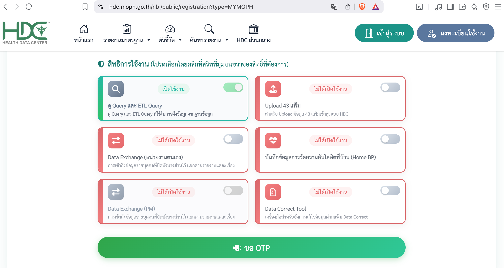
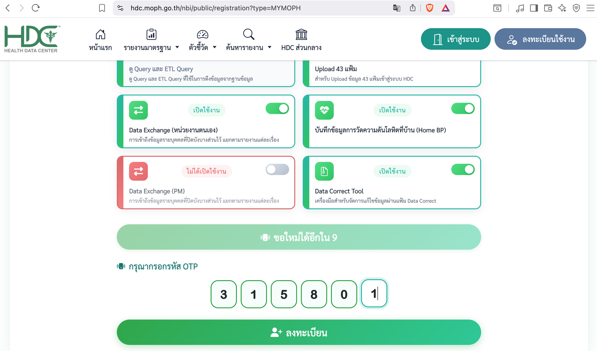
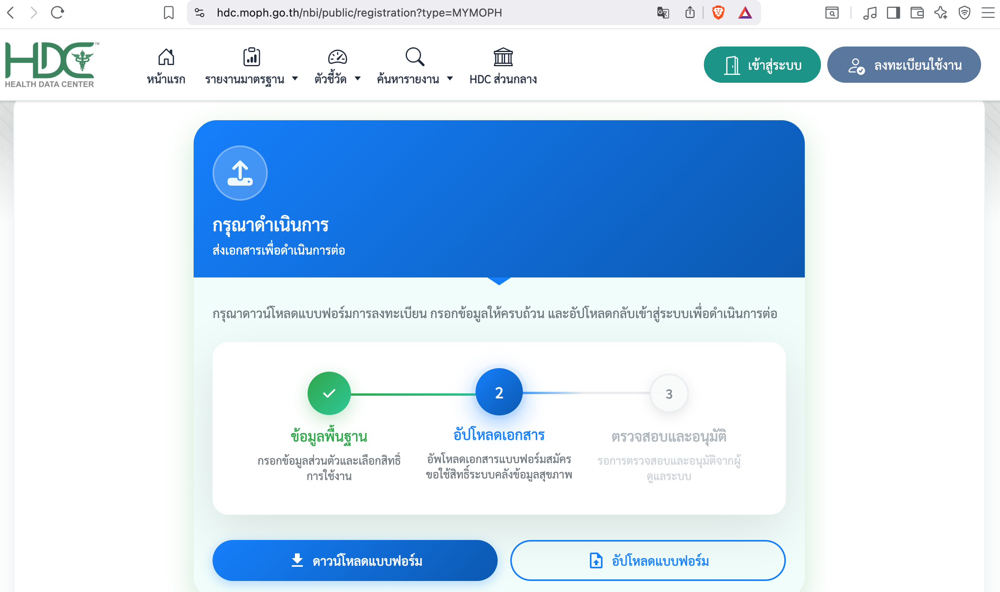
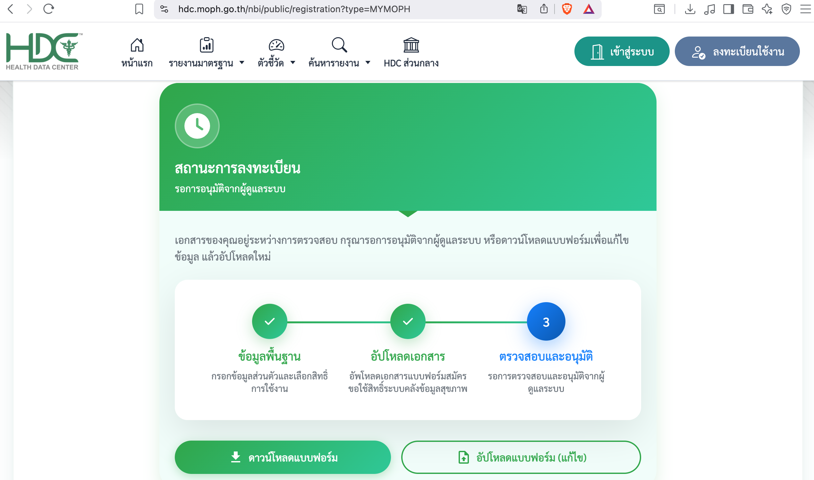
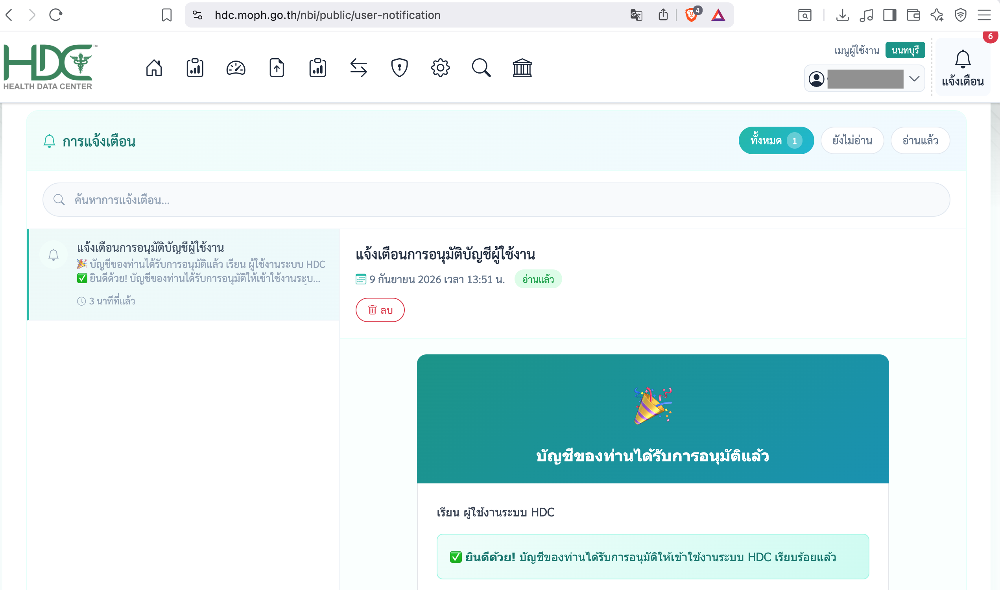

# คู่มือการสมัครใช้งานระบบ HDC (สำหรับผู้ใช้ทั่วไป)

ยินดีต้อนรับเข้าสู่ระบบคลังข้อมูลสุขภาพ (Health Data Center: HDC) หน้านี้จะแนะนำขั้นตอนการลงทะเบียนเพื่อเข้าใช้งานระบบอย่างละเอียด

## 🌐 ช่องทางการเข้าสู่หน้าลงทะเบียน
1. เข้าเว็บไซต์ระบบ HDC ประจำจังหวัดของท่าน `https://hdc.moph.go.th/xxx`
2. ที่มุมบนขวาของหน้าจอหลัก จะมีปุ่มสำหรับเข้าใช้งานระบบ

    * **สำหรับผู้ที่มีบัญชีอยู่แล้ว:** ให้คลิกปุ่ม **"เข้าสู่ระบบ"** เพื่อเลือกช่องทางการล็อกอินเข้าใช้งาน
    * **สำหรับผู้ใช้ใหม่:** ให้คลิกปุ่ม **"ลงทะเบียนใช้งาน"** เพื่อเริ่มสร้างบัญชี

## 🔐 ขั้นตอนที่ 1: เลือกวิธียืนยันตัวตน และยอมรับนโยบาย
เมื่อเข้าสู่หน้าลงทะเบียน ระบบจะแสดงแถบความคืบหน้า 3 ขั้นตอน ให้ท่านเริ่มต้นที่การเลือกช่องทางการยืนยันตัวตน โดยสามารถเลือกใช้:

* **ThaiD** (บัตรประชาชนดิจิทัล)
* **MyMOPH** (บัญชีกระทรวงสาธารณสุข)

**การยอมรับนโยบายความเป็นส่วนตัว (PDPA)**

* **กรณีลงทะเบียนหรือเข้าใช้งานครั้งแรก:** ระบบจะแสดงหน้ารายละเอียดการคุ้มครองข้อมูลส่วนบุคคล ให้อ่านรายละเอียดแล้วคลิกปุ่ม "ยอมรับ" เพื่อดำเนินการต่อ
* **กรณีเคยลงทะเบียนมาแล้ว:** ระบบจะไม่แสดงหน้านี้และจะข้ามไปขั้นตอนถัดไปโดยอัตโนมัติ

> ⚠️ **โปรดทราบ (กรณีมีบัญชีอยู่แล้ว):** หากท่านเคยลงทะเบียนไว้แล้ว ระบบจะแจ้งเตือนให้ทราบ หากท่านดำเนินการลงทะเบียนใหม่ ระบบจะยกเลิกบัญชีและสิทธิ์การใช้งานเดิมที่มีอยู่ทันที

## 📄 ขั้นตอนที่ 2: ข้อมูลพื้นฐาน และเลือกสิทธิ์การใช้งาน
ตรวจสอบและระบุรายละเอียดในฟอร์มให้ครบถ้วน:

### 1. ข้อมูลรายละเอียดผู้ใช้งาน
* **เลขประจำตัวประชาชน / ชื่อ-นามสกุล:** ระบบจะดึงข้อมูลมาให้โดยอัตโนมัติ (แก้ไขไม่ได้)
* **โทรศัพท์มือถือ:** กรอกเบอร์โทรศัพท์ที่ใช้งานจริงเพื่อรับรหัส OTP
* **อีเมล:** กรอกอีเมลสำหรับรับแจ้งเตือนจากระบบ
* **จังหวัด / หน่วยงาน:** เลือกสถานพยาบาลหรือหน่วยงานสาธารณสุขที่ท่านสังกัดจริง

### 2. เลือกสิทธิ์การใช้งานที่ต้องการ
โปรดเลือกโดยคลิกที่สวิตช์มุมบนขวาของสิทธิ์ที่ต้องการ (เปลี่ยนเป็นสีเขียว "เปิดใช้งาน")

* **ดู Query และ ETL Query:** สิทธิ์ดูซอร์สโค้ดคำสั่งและขั้นตอนการประมวลผลข้อมูล
* **Upload 43 แฟ้ม:** สิทธิ์ส่งและอัปโหลดไฟล์ข้อมูลมาตรฐาน 43 แฟ้มเข้าสู่ระบบ
* **Data Exchange (หน่วยงานตนเอง):** สิทธิ์เข้าถึงและแลกเปลี่ยนข้อมูลรายบุคคลที่ปิดบังส่วนตัวไว้
* **บันทึกข้อมูลการวัดความดันโลหิตที่บ้าน (Home BP):** สิทธิ์บันทึกและติดตามผลการวัดความดันโลหิต
* **Data Exchange (PM):** สิทธิ์เข้าถึงข้อมูลรายบุคคลภาพรวม แยกตามรายงานแต่ละเรื่อง
* **Data Correct Tool:** เครื่องมือสำหรับจัดการแก้ไขข้อมูลผ่านแฟ้ม Data Correct

> 💬 เมื่อกรอกข้อมูลและเลือกสิทธิ์เรียบร้อยแล้ว ให้คลิกปุ่ม "ขอ OTP" จากนั้นนำรหัส 6 หลักที่ได้รับทาง SMS มากดยืนยัน แล้วคลิกปุ่ม **"ลงทะเบียน"**

## 📝 ขั้นตอนที่ 3: การดาวน์โหลดคำขอและการอัปโหลดเอกสารอนุมัติ
หลังจากลงทะเบียนสำเร็จ ระบบจะพามาสู่ขั้นตอนการส่งเอกสารที่มีการลงนามรับรองจากผู้บังคับบัญชา

### 1. ดาวน์โหลดและเตรียมเอกสาร
1. คลิกปุ่ม **"ดาวน์โหลดแบบฟอร์ม"** ระบบจะสร้างไฟล์คำขอในรูปแบบ PDF ที่กรอกข้อมูลให้ท่านโดยอัตโนมัติ
2. พิมพ์ (Print) เอกสารออกมา ลงลายมือชื่อผู้สมัคร
3. นำไปเสนอให้ **ผู้บังคับบัญชา** ลงนามรับรองในเอกสารให้ครบถ้วน

### 2. อัปโหลดเอกสารเข้าสู่ระบบ
1. นำแบบฟอร์มที่ลงนามครบถ้วนแล้ว มาสแกนหรือถ่ายภาพให้ชัดเจน
2. คลิกปุ่ม **"อัปโหลดแบบฟอร์ม"** เพื่อส่งหลักฐานเข้าสู่ระบบ

## ⏳ ขั้นตอนที่ 4: การตรวจสอบและติดตามผล
หลังจากอัปโหลดเอกสารสำเร็จ สถานะคำขอจะเข้าสู่สถานะ **"รอการอนุมัติจากผู้ดูแลระบบ"**

* **กรณีต้องแก้ไข:** หากเอกสารไม่ถูกต้อง ท่านสามารถกดปุ่ม "อัปโหลดแบบฟอร์ม (แก้ไข)" เพื่อส่งเอกสารชุดใหม่ได้ตลอดเวลา
* **เมื่ออนุมัติเสร็จสิ้น:** ระบบจะมีการแจ้งเตือนในเมนู "การแจ้งเตือน" ว่า **บัญชีของท่านได้รับการอนุมัติแล้ว** จากนั้นท่านสามารถเข้าสู่ระบบเพื่อใช้งานได้ทันที

---
❓ **ต้องการความช่วยเหลือ?**
หากท่านพบปัญหาในการลงทะเบียน สามารถติดต่อได้ที่ แอดมินจังหวัด สำนักงานสาธารณสุขจังหวัด (สสจ.)